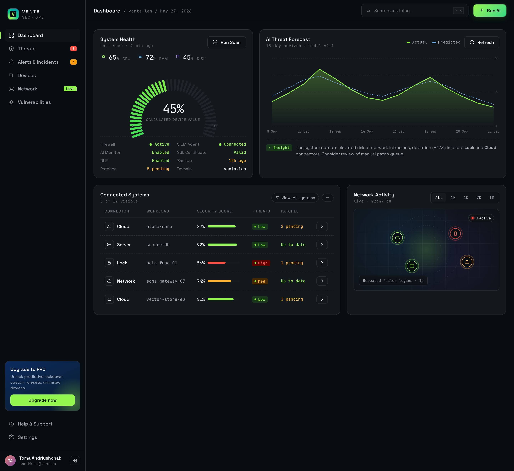
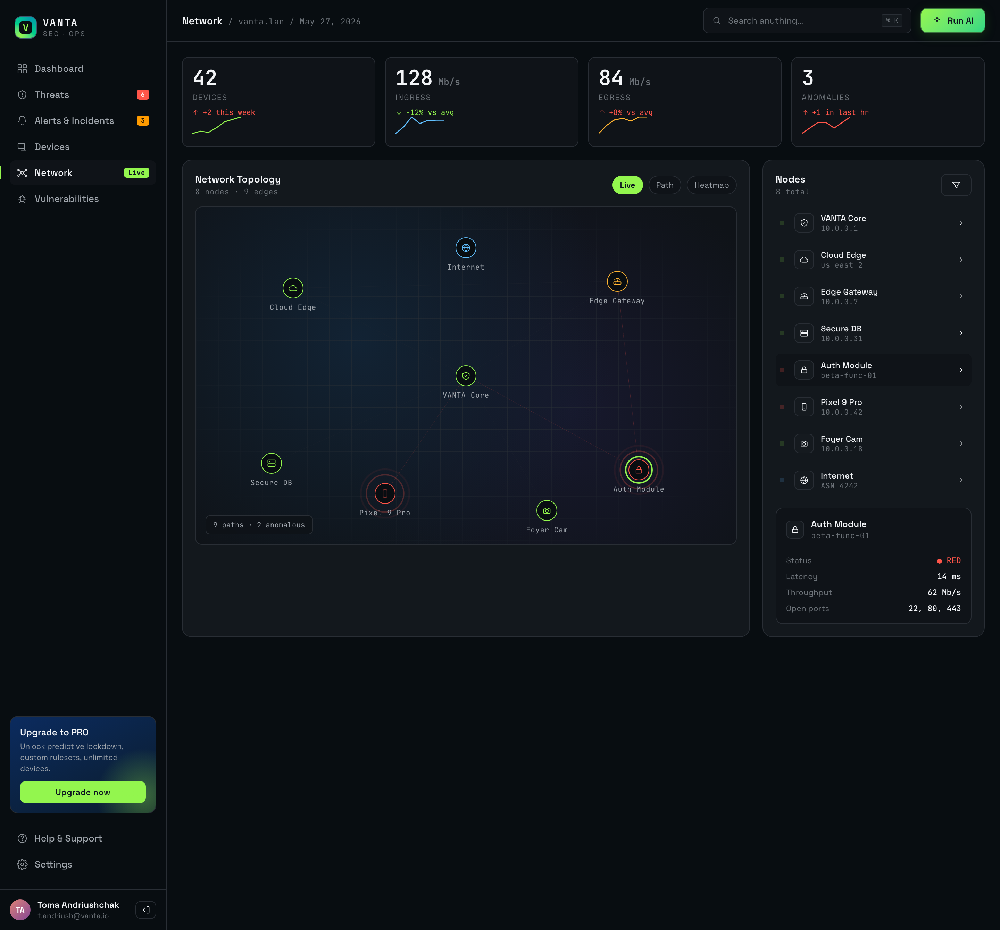
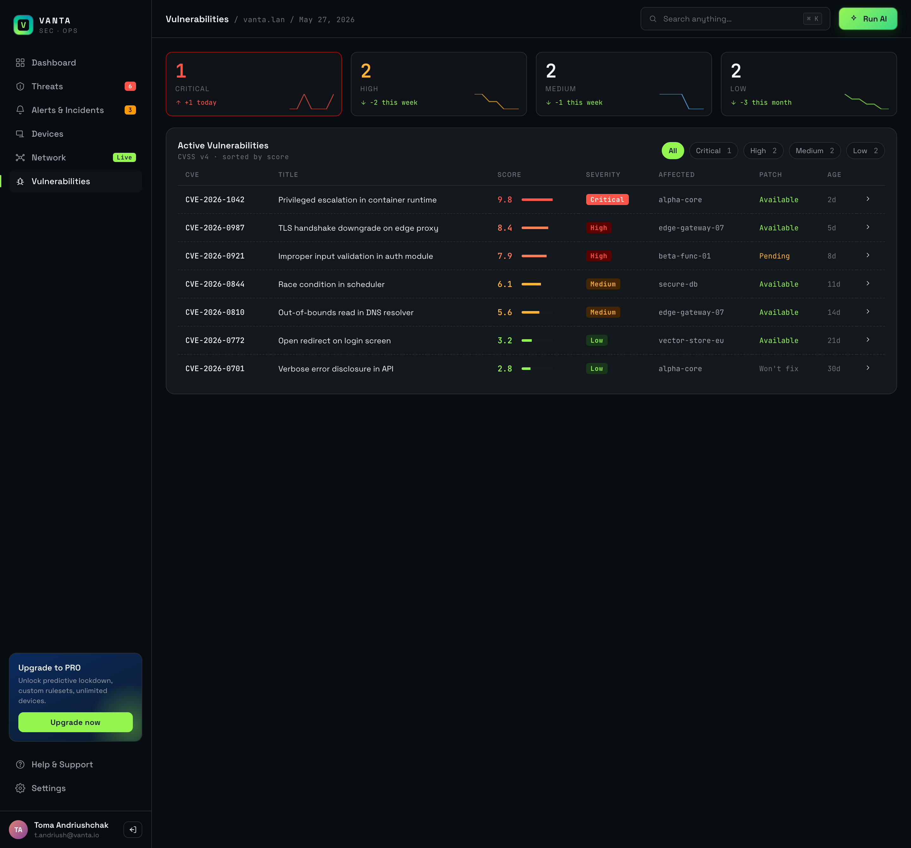
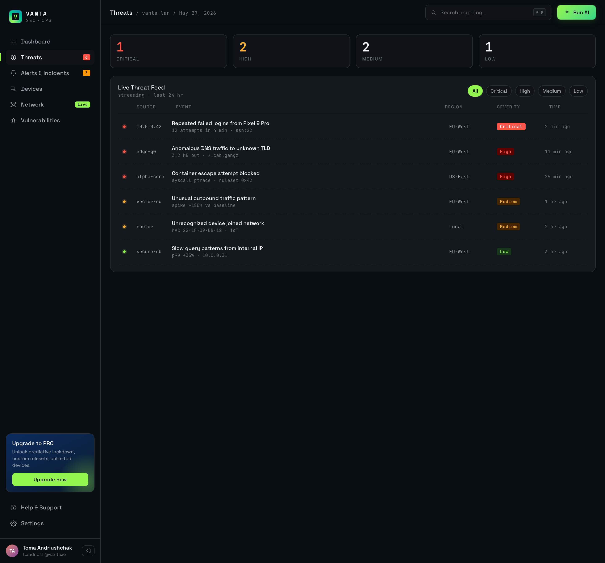
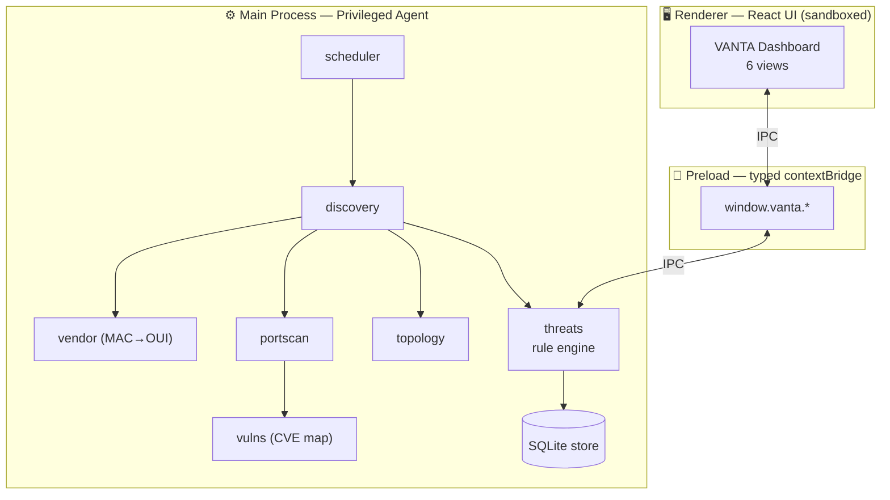

<div align="center">

# 🛡️ VANTA

### Local Network Security Monitor

**Turn your own network into a live security operations center — right from your desktop.**

[](./CHANGELOG.md)
[](https://www.electronjs.org/)
[](https://react.dev/)
[](https://www.typescriptlang.org/)
[](https://vite.dev/)


<br/>



<sub><i>Design preview — the interface VANTA is being built to, at 99% fidelity.</i></sub>

</div>

---

## What is VANTA?

**VANTA is a cross-platform desktop app that turns your home or office LAN into a real-time security operations center.** It discovers every device on your network, scans them for known vulnerabilities, maps your topology as it changes, and classifies suspicious activity into an actionable threat feed.

Everything runs **locally** — a privileged on-device agent does the network work, while a sandboxed UI renders it. **No cloud, no telemetry, nothing leaves your machine.** VANTA only ever inspects the local subnet you're connected to, and performs **detection only** — it never exploits or alters your devices.

> In one line: **see every device, every weakness, and every anomaly on your own network — without sending a single byte to the cloud.**

---

## ✨ Features

| | Capability | What it does |
|---|---|---|
| 🖥️ | **Dashboard** | Composite security-health gauge, live host metrics, top-risk systems, and a threat-trend forecast |
| 📡 | **Devices** | Auto-discovers every device on your LAN (ARP + mDNS), classified by type and vendor |
| 🌐 | **Network** | Live topology — your gateway at the core, hosts radiating out, compromised nodes pulsing red |
| 🐞 | **Vulnerabilities** | Per-host CVEs with CVSS scores, severity, and patch guidance (deep scan via `nmap` when available) |
| 🚨 | **Threats** | A real-time, classified event feed: new devices, risky ports, CVEs, gateway/DNS changes, anomalies |

---

## 🖼️ Screens

<div align="center">

| Network Topology | Vulnerabilities |
|:---:|:---:|
|  |  |

| Live Threat Feed |
|:---:|
|  |

</div>

---

## 🧭 Architecture

A two-process Electron app: a **sandboxed React renderer** (pure UI) talks through a **typed `contextBridge`** to a **privileged main-process agent** that does all the network work. See [ARCHITECTURE.md](./ARCHITECTURE.md) for detail.



---

## 🛠️ Tech stack

- **Desktop shell:** Electron · `electron-vite` · `electron-builder`
- **UI:** React 19 · TypeScript · Vite
- **Agent:** TypeScript/Node — `systeminformation`, ARP/mDNS discovery, `better-sqlite3`, optional `nmap`
- **Quality:** Vitest + React Testing Library, ESLint, strict TypeScript

---

## 🚀 Getting started

> Requires **Node.js 20+** and **npm**. Optional: install **`nmap`** for deep service/version + CVE scanning (the app works without it at reduced depth).

```bash
git clone https://github.com/jennofrie/vanta-dashboard.git
cd vanta-dashboard
npm install      # install dependencies
npm run dev      # launch the app (HMR)
npm run build    # type-check and build
npm test         # run the test suite
npm run package  # build a distributable installer (once Electron is wired)
```

---

## 🗺️ Roadmap

- [x] Approved design spec + implementation plan
- [x] Project scaffold & docs
- [x] **Phase 1** — Electron shell + 99% UI port
- [x] **Phase 2** — Agent core (discovery, store, scheduler) → live **Devices**
- [x] **Phase 3** — Network **Topology** from real hosts
- [x] **Phase 4** — **Vulnerabilities** (port scan + exposure findings)
- [ ] **Phase 5** — **Threats** rule engine (priority)
- [ ] **Phase 6** — Dashboard wiring + cross-platform installers

See [CHANGELOG.md](./CHANGELOG.md) for current status and the [design spec](./docs/superpowers/specs/) for full detail.

---

## 🔒 Security & responsible use

VANTA scans **only the local subnet of your active interface** and never reaches beyond it. Use it only on networks you own or are explicitly authorized to monitor. It performs **detection and classification only** — no exploitation, no telemetry, no cloud. Full policy in [SECURITY.md](./SECURITY.md).

---

## 📄 License

Proprietary. © 2026 **JD Digital Systems**. All rights reserved.

<div align="center">
<sub>Designed & built by <b>JD Digital Systems</b></sub>
</div>
